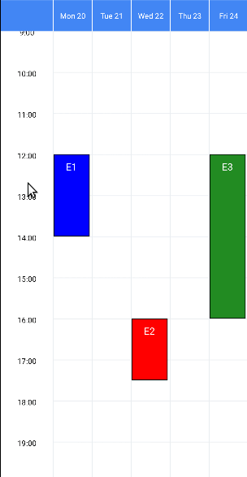

  

# react-native-week-view
The week view component for react-native.

* Supported in Android and iOS
* Many user interactions supported: **drag and drop events**, edit events, swipe through pages, event press, grid press, etc
* Customizable styles
* Multiple locale support

Checkout the full [documentation site](https://hoangnm.github.io/react-native-week-view), including [guides](https://hoangnm.github.io/react-native-week-view/category/full-api), [full API](https://hoangnm.github.io/react-native-week-view/category/full-api) and [known issues](https://hoangnm.github.io/react-native-week-view/troubleshoot#known-issues).


 


## Installation

> `npm install --save react-native-week-view`

or

> `yarn add react-native-week-view`

**Requirements:** install peer dependencies [react-native-gesture-handler](https://docs.swmansion.com/react-native-gesture-handler/docs/installation/) >= 2.4.1 and [react-native-reanimated](https://docs.swmansion.com/react-native-reanimated/docs/fundamentals/installation) >=2.0.0, which we use to provide smoother interactions and animations (e.g. drag and drop).


## Basic usage

```js
import WeekView from 'react-native-week-view';

const myEvents = [
 {
 id: 1,
 description: 'Event',
 startDate: new Date(2021, 3, 15, 12, 0),
 endDate: new Date(2021, 3, 15, 12, 30),
 color: 'blue',
 // ... more properties if needed,
 },
 // More events...
];

const MyComponent = () => (
 <WeekView
 events={myEvents}
 selectedDate={new Date(2021, 3, 15)}
 numberOfDays={7}
 />
);

```

See the [full documentation](https://hoangnm.github.io/react-native-week-view) with more examples and details!


## Changelog

API is still unstable, minor updates before v1.0.0 can include breaking changes, adhering to Semantic Versioning.
See [CHANGELOG.md](./CHANGELOG.md) for details.

## Contributors

<a href="https://github.com/hoangnm/react-native-week-view/graphs/contributors">
 
</a>

Made with [contrib.rocks](https://contrib.rocks).
