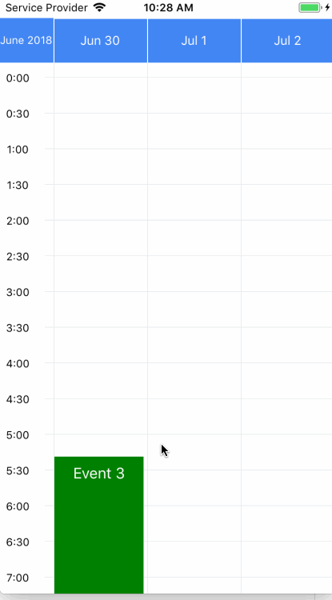

# react-native-week-view




## Basic usage

```js
import WeekView from 'react-native-week-view';

const myEvents = [
  {
    id: 1,
    description: 'Event',
    startDate: new Date(2021, 3, 15, 12, 0),
    endDate: new Date(2021, 3, 15, 12, 30),
    color: 'blue',
    // ... more properties if needed,
  },
  // More events...
];

const MyComponent = () => (
  <WeekView
    events={myEvents}
    selectedDate={new Date(2021, 3, 15)}
    numberOfDays={7}
  />
);

```

## Full API

### Props
* **`events`** _(Array)_ - Events to display, in `Event Object` format (see [sub-section below](#event-object))
* **`onEventPress`** _(Function)_ - Callback when event item is pressed, receives the event-object: `(event) => {}`.
* **`onEventLongPress`** _(Function)_ - Callback when event item is long pressed, same signature as `onEventPress`.
* **`numberOfDays`** _(Number)_ - Set number of days to show in view, can be `1`, `3`, `5`, `7`.
* **`weekStartsOn`** _(Number)_ - Day to start the week (0 is Sunday, 1 is Monday, and so on). Defaults to 1. Only useful when `numberOfDays === 7` or `fixedHorizontally` is true.
* **`formatDateHeader`** _(String)_ - Format for dates of header, default is `MMM D`
* **`selectedDate`** _(Date)_ - Intial date to show week/days in the view. Note: changing this prop will not have any effect in the displayed date; to actually change the date being displayed, use the `goToDate()` method, see below.
* **`onSwipeNext`** _(Function)_ - Callback when calendar is swiped to next week/days
* **`onSwipePrev`** _(Function)_ - Callback when calendar is swiped to previous week/days
* **`locale`** _(String)_ - locale for the header, there's a `addLocale` function to add cusomized locale. Default is `en`.
* **`showTitle`** _(Boolean)_ - show/hide the title (the selected month and year). Default is `true`.
* **`headerStyle`** _(Object)_ - custom styles for header container. Example: `{ backgroundColor: '#4286f4', color: '#fff', borderColor: '#fff' }`
* **`headerTextStyle`** _(Object)_ - custom styles for text inside header. Includes day names and title (month)
* **`hourTextStyle`** _(Object)_ - custom styles for text displaying hours in the left.
* **`eventContainerStyle`** _(Object)_ - custom styles for the event container. Notice the background color and positioning (absolute) are already set.
* **`hoursInDisplay`** _(Number)_ - Amount of hours to display in the screen. Default is 6.
* **`timeStep`** _(Number)_ - Number of minutes to use as step in the time labels shown in the left. Default is 60 (1 hour).
* **`formatTimeLabel`** _(String)_ - Formatter for the time labels shown in the left. Defaults to `"H:mm"` (e.g. 16:00, 16:30, etc). To use AM/PM formatting, set to `"h:mm A"` (e.g. 4:00 PM, 4:30 PM, etc), or `"h:mm a"` for lowercase. See [docs on momentjs](https://momentjs.com/docs/#/displaying/format/) for all available formatters.
* **`startHour`** _(Number)_ - Hour to scroll to on start. Default is 8 (8 am).
* **`onGridClick`** _(Function)_ - Callback when the grid view is clicked, signature: `(pressEvent, startHour, date) => {}`.
  * `pressEvent` _(Object)_ - object passed by the [TouchableWithoutFeedback.onPress() method](https://reactnative.dev/docs/touchablewithoutfeedback#onpress) (and not an event object as defined below)
  * `startHour` _(Number)_ - hour clicked (as integer)
  * `date` _(Date)_ - date object indicating day clicked (the hour is not relevant)
* **`onGridLongPress`** _(Function)_ - Callback when the grid view is long-pressed. Same signature as `onGridClick`
* **`EventComponent`** _(React.Component)_ - Custom component rendered inside an event. By default, is a `Text` with the `event.description`. See [sub-section below](#custom-eventcomponent) for details on the component.
* **`TodayHeaderComponent`** _(React.Component)_ - Custom component to highlight today in the header (by default, *today* looks the same than every day). See details in [sub-section below](#custom-todaycomponent)
* **`showNowLine`** _(Boolean)_ - If `true`, displays a line indicating the time right now. Defaults to `false`.
* **`nowLineColor`** _(String)_ - Color used for the now-line. Defaults to a red `#e53935`.
* **`rightToLeft`** _(Boolean)_ - If `true`, render older days to the right and more recent days to the left.
* **`fixedHorizontally`** _(Boolean)_ - If `true`, the component can be used to display a single fixed week. See example in [sub-section below](#fixed-week).
* **`isRefreshing`** _(Boolean)_ - If `true`, the component will show the `<RefreshComponent />` in the middle of the grid.
* **`RefreshComponent`** _(React.Component)_ - Component used when `isRefreshing` is `true`. Receives a `style` prop that must be passed down (sets the component position), for example: `MyRefreshControl = ({ style }) => <Text style={style}>loading...</Text>`. Defaults to an `<ActivityIndicator />` with default parameters (notice the `ActivityIndicator` default color in some devices may be white).
* **`prependMostRecent`** _(Boolean)_ - If `true`, the horizontal prepending is done in the most recent dates. See [issue #39](https://github.com/hoangnm/react-native-week-view/issues/39) for more details. Default is `false`.
* **`onDragEvent`** _(Function)_ - Callback when event item is dragged to another position, signature: `(event, newStartDate, newEndDate) => {}`. The `event` returns the event moved, and the `newStartDate` and `newEndDate` are `Date` objects with day and hour of the new position (precision up to minutes). In this callback you should trigger an update on the `events` prop (i.e. update your DB), with the updated information from the event. The events are draggable only if this callback is provided.

### Event Object
```js
{
  id: 1,
  description: 'Event',
  startDate: new Date(2021, 3, 15, 12, 0),
  endDate: new Date(2021, 3, 15, 12, 30),
  color: 'blue',
  // ... more properties if needed,
}
```

### Methods

To use the component methods save a reference to it:
```js
<WeekView
  // ... other props
  ref={(ref) => { this.weekViewRef = ref; }}
/>
```

* **`goToDate(date, animated = true)`**: the component navigates to a custom date. Note: if the target date has not been rendered before, there may be a delay on the animation. See [this issue](https://github.com/hoangnm/react-native-week-view/issues/54) for details.
* **`goToNextPage(animated = true)`**: the component navigates to the next page (to the future). Note: if `prependMostRecent` is `true`, and the component is near the last page rendered, there may be a delay on the animation.
* **`goToPrevPage(animated = true)`**: the component navigates to the previous page (to the past). Note: if `prependMostRecent` is `false` (the default), and the component is near the first page rendered, there may be a delay on the animation.


### Custom `EventComponent`
The custom component will be rendered inside a `TouchableOpacity`, which has the background color set to `event.color`, and is placed with absolute position in the grid. The component receives two props:
* **`event`** _(Event)_ - Event object as described before.
* **`position`**: _(Object)_ - object containing `top`, `left`, `height` and `width` values in pixels.

For example, to display an icon inside each event, such as a [react-native-elements Icon](https://react-native-elements.github.io/react-native-elements/docs/icon/):
```js
const MyEventComponent = ({ event, position }) => (
  <Icon
    name={event.iconName}
    type={event.iconType}
    color={event.color}
    size={position.height}
  />
);

<WeekView
  // ... other props
  EventComponent={MyEventComponent}
/>
```


### Custom TodayComponent
Use this prop to highlight today in the header, by rendering it differently from the other days. The component `TodayHeaderComponent` receives these props:
* `date` _(moment Date)_ - moment date object containing today's date.
* `formattedDate` _(String)_ - day formatted according to `formatDateHeader`, e.g. `"Mon 3"`.
* `textStyle` _(Object)_ - text style used for every day.

For example, to highlight today with a bold font:
```js
const MyTodayComponent = ({ formattedDate, textStyle }) => (
  <Text style={[textStyle, { fontWeight: 'bold' }]}>{formattedDate}</Text>
);

<WeekView
  // ... other props
  TodayHeaderComponent={MyTodayComponent}
/>
```

### Locales customization

There's a `addLocale` function to add customized locale for the component. The component depends on `momentjs`, you can refer to https://momentjs.com/docs/#/customization/ for more information.

Example:
```js
export WeekView, { addLocale } from 'react-native-week-view';
// add customized localed before using locale prop.
addLocale('fr', {
  months: 'janvier_février_mars_avril_mai_juin_juillet_août_septembre_octobre_novembre_décembre'.split('_'),
  monthsShort: 'janv._févr._mars_avr._mai_juin_juil._août_sept._oct._nov._déc.'.split('_'),
  weekdays: 'dimanche_lundi_mardi_mercredi_jeudi_vendredi_samedi'.split('_'),
  weekdaysShort: 'dim._lun._mar._mer._jeu._ven._sam.'.split('_'),
});
```

## Other example usages

### Fixed week

The `WeekView` component can be used to display a fixed week (as a timetable):

* Use the prop `fixedHorizontally={true}`. This prop should not be changed after the first render

* To set `startDate` and `endDate` in each event, you should use the function provided: `createFixedWeekDate(day, hour, minutes=0, seconds=0)`, where:
  * `day`: _(Number|String)_ - specify day of the week as number (1 is monday, 2 is tuesday, etc) or as string (will be parsed with the current locale, e.g. `"Monday"`, `"Tuesday"`, etc. for english).
  * `hour`: _(Number)_ - specify hour of the day as number (from 0 to 23)
  * `minutes`: _(Number)_ - specify minutes of the day as number (from 0 to 59), defaults to 0
  * `seconds`: _(Number)_ - specify seconds of the day as number (from 0 to 59), defaults to 0

  If you choose to not use `createFixedWeekDate()`, make sure that `startDate` and `endDate` are `Date` objects within this week, otherwise the events will not be displayed correctly in the timetable.


* If the `numberOfDays` is other than 7, will display the first days of the week. E.g. if `numberOfDays === 5`, will display from monday to friday.


```js
import WeekView, { createFixedWeekDate } from 'react-native-week-view';

const myEvents = [
  {
    id: 1,
    description: 'Event 1',
    startDate: createFixedWeekDate('Monday', 12), // Day may be passed as string
    endDate: createFixedWeekDate(1, 14), // Or as number, 1 = monday
    color: 'blue',
  },
  {
    id: 2,
    description: 'Event 2',
    startDate: createFixedWeekDate('wed', 16),
    endDate: createFixedWeekDate(3, 16, 30),
    color: 'red',
  },
];

const MyComponent = () => (
  <WeekView
    events={myEvents}
    fixedHorizontally={true}
    // Recommended props:
    showTitle={false} // if true, shows this month and year
    numberOfDays={7}
    formatDateHeader="ddd" // display short name days, e.g. Mon, Tue, etc
    // ... other props
  />
);
```
