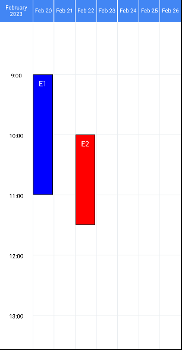
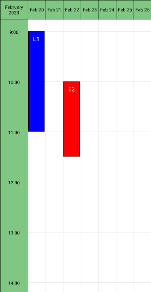
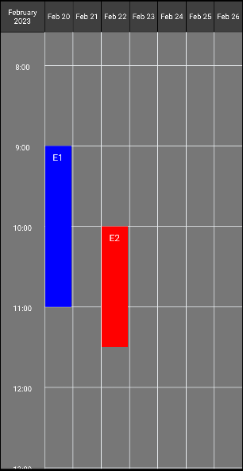

# Basic usage

Check the following examples for a quick start.
See the [guides section](./category/guides) for more practical examples, and check all available props and details in the [Full API](./full-api/week-view-props).


## Minimal example

<CodeDemo imgSrc={require('../static/img/basic-usage/minimal.png').default}>

```js
import WeekView from 'react-native-week-view';

const myEvents = [
  {
    id: 1,
    startDate: new Date(2023, 1, 20, 9),
    endDate: new Date(2023, 1, 20, 11),
    color: 'blue',
    description: 'E1',
    // ... more properties if needed,
  },
  {
    id: 2,
    startDate: new Date(2023, 1, 22, 10),
    endDate: new Date(2023, 1, 22, 11, 30),
    color: 'red',
    description: 'E2',
  },
  // more events...
];

const MyComponent = () => (
  <WeekView
    events={myEvents}
    selectedDate={new Date(2023, 1, 20, 12)}
    numberOfDays={7}
    pageStartAt={{ weekday: 1 }}
  />
);

```

</CodeDemo>


## Press events and grid

You can provide a callback to listen to UI interactions, such as pressing events or pressing the grid.
See the following example, and more details in the [Full API](./full-api/week-view-props#press-callbacks).

<CodeDemo imgSrc={require('../static/img/basic-usage/press-alerts.gif').default}>

```js
<WeekView
  onEventPress={event => Alert.alert(`Pressed event: ${event.color} - ${event.id}`)}
  onGridClick={(pressEvent, startHour, date) => Alert.alert(
    `Pressed grid: ${date.toDateString()} ${date.toLocaleTimeString()}`,
  )}
  onDayPress={(date, formattedDate) => Alert.alert(`Pressed day: ${formattedDate}`)}
  onMonthPress={(date, formattedDate) => Alert.alert(`Pressed month: ${formattedDate}`)}
/>
```

</CodeDemo>


## Customize styles

You can customize the component outlook with the following props.

```js title="Style props"
<SafeAreaView style={styles.container}>
  <WeekView
    headerStyle={styles.header}
    headerTextStyle={styles.headerText}
    hourTextStyle={styles.hourText}
    eventContainerStyle={styles.eventContainer}
    gridColumnStyle={styles.gridColumn}
    gridRowStyle={styles.gridRow}
    hourContainerStyle={styles.hourContainer}
  />
</SafeAreaView>
```

See an example below, and check the [full API](./full-api/week-view-props#styles-and-formats) for more details.


| `stylesBlue` | `stylesGreen` | `stylesDark` |
|:---:|:---:|:---:|
|  |  |  |


import Tabs from '@theme/Tabs';
import TabItem from '@theme/TabItem';

<Tabs>
  <TabItem value="blue" label="stylesBlue" default>

```js title="Blue example"
const stylesBlue = StyleSheet.create({
  container: {
    flex: 1,
    backgroundColor: '#FFF',
  },
  header: {
    backgroundColor: '#4286f4',
    borderColor: '#fff',
  },
  headerText: {
    color: 'white',
  },
  hourText: {
    color: 'black',
  },
  eventContainer: {
    borderWidth: 1,
    borderColor: 'black',
  },
});
```

  </TabItem>
  <TabItem value="green" label="stylesGreen">

```js title="Green example"
const stylesGreen = StyleSheet.create({
  container: {
    flex: 1,
    backgroundColor: '#fff',
  },
  header: {
    backgroundColor: '#81c784',
    borderColor: 'black',
  },
  headerText: {
    color: 'black',
  },
  hourText: {
    color: 'black',
  },
  hourContainer: {
    backgroundColor: '#81c784',
  },
  eventContainer: {
    borderWidth: 1,
    borderColor: 'black',
  },
  gridRow: {
    borderTopWidth: 1,
    borderColor: '#dfdfdf',
  },
  gridColumn: {
    borderLeftWidth: 1,
    borderColor: '#dfdfdf',
  },
});
```

  </TabItem>
  <TabItem value="dark" label="stylesDark">

```js title="Dark example"
const stylesDark = StyleSheet.create({
  container: {
    flex: 1,
    backgroundColor: '#777777',
  },
  header: {
    backgroundColor: '#3f3f3f',
    borderColor: '#000',
  },
  headerText: {
    color: 'white',
  },
  hourText: {
    color: 'white',
  },
  gridRow: {
    borderTopWidth: 1,
    borderColor: '#E9EDF0',
  },
  gridColumn: {
    borderLeftWidth: 1,
    borderColor: '#E9EDF0',
  },
});
```

  </TabItem>
</Tabs>
