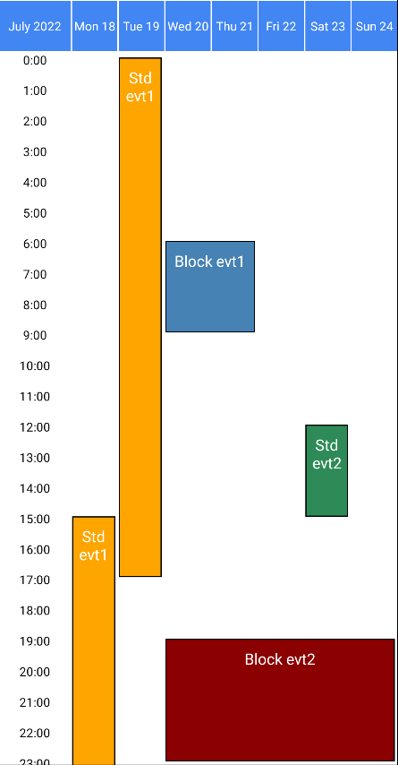

# Block-like events



```js
const myEvents = [
  // Standard events that span >1 day are displayed with one box per day
  {
    id: 1,
    description: 'Std evt1',
    startDate: new Date(2022, 6, 18, 15),
    endDate: new Date(2022, 6, 19, 17),
    color: 'orange',
  },
  {
    id: 2,
    description: 'Std evt2',
    startDate: new Date(2022, 6, 23, 12),
    endDate: new Date(2022, 6, 23, 15),
    color: 'seagreen',
  },
  // Block events that span >1 day are displayed **just as one box**
  // (i.e. as a block)
  {
    id: 3,
    description: 'Block evt1',
    startDate: new Date(2022, 6, 20, 6, 0),
    endDate: new Date(2022, 6, 21, 9, 0),
    color: 'steelblue',
    eventKind: 'block',
  },
  {
    id: 4,
    description: 'Block evt2',
    startDate: new Date(2022, 6, 20, 19, 0),
    endDate: new Date(2022, 6, 24, 23, 0),
    color: 'darkred',
    eventKind: 'block',
  },
]
```