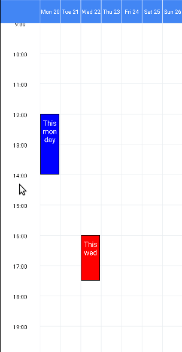
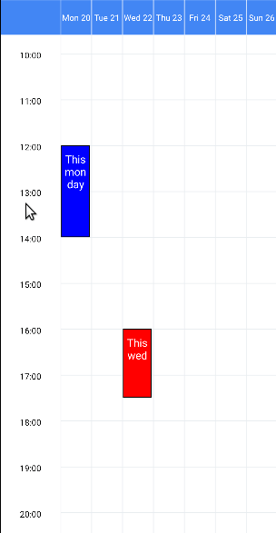

# Pages navigation

You can navigate naturally with your fingers by scrolling through dates (horizontally) and scrolling through hours of the day (vertically).
This guide describes further details about scrolling.

## Navigate programatically

There are several methods available to navigate to a date or time programatically.

* **`scrollToTime(minutesInDay)`**: scroll vertically to a time in the day
* **`goToDate(date)`**: scroll horizontally to a custom date
* **`goToNextPage()`**: navigate to the next page (to the future)
* **`goToPrevPage()`**: navigate to the previous page (to the past)
* **`goToNextDay()`**: navigate to the next day (to the future). Requires `allowScrollByDay={true}` to work properly.
* **`goToPrevDay()`**: navigate to the previous day (to the past). Requires `allowScrollByDay={true}` to work properly.

See more details about the methods in the [full API](../full-api/week-view-methods).

## Scroll one day at the time

Set the prop [`allowScrollByDay`](../full-api/week-view-props#allowscrollbyday) to `true` to allow scrolling horizontally by one day. If `false` (the default), the scrolling goes one page at the time.

| Scroll by page (default) | Scroll by day |
| :---: | :---: |
| `allowScrollByDay={false}` | `allowScrollByDay={true}` |
|  |  |
