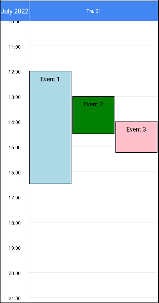
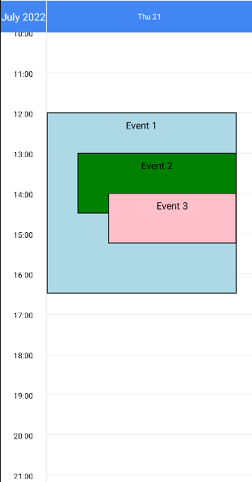
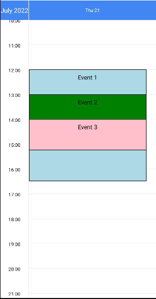
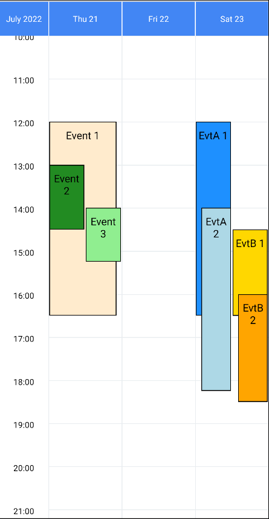

# Overlap handling

The library handles the case when two or more events overlap in time.

## Simple usage

For each event provide `resolveOverlap: <method>`, for example:


|               Lane (default)               |                    Stack                     |                     Ignore                     |
| :----------------------------------------: | :------------------------------------------: | :--------------------------------------------: |
|  |  |  |


```js
const method = 'lane' | 'stack' | 'ignore'
const awesomeEvents = [
  {
    id: 1,
    description: 'Event 1',
    startDate: new Date(2022, 6, 21, 12, 0, 0),
    endDate: new Date(2022, 6, 21, 16, 30, 0),
    color: 'lightblue',
    resolveOverlap: method,
  },
  {
    id: 2,
    description: 'Event 2',
    startDate: new Date(2022, 6, 21, 13, 0, 0),
    endDate: new Date(2022, 6, 21, 14, 30, 0),
    color: 'green',
    resolveOverlap: method,
  },
  {
    id: 3,
    description: 'Event 3',
    startDate: new Date(2022, 6, 21, 14, 0, 0),
    endDate: new Date(2022, 6, 21, 15, 15, 0),
    color: 'pink',
    resolveOverlap: method,
  },
]
```

## Advanced usage

You can mix different methods and use `stackKey` for the stack method to better suit your needs. For example:



```js
const mixIgnoreWithLane = [
  {
    id: 1,
    startDate: new Date(2022, 6, 21, 12, 0, 0),
    endDate: new Date(2022, 6, 21, 16, 30, 0),
    color: 'blanchedalmond',
    description: 'Event 1',
    resolveOverlap: 'ignore',
  },
  {
    id: 2,
    startDate: new Date(2022, 6, 21, 13, 0, 0),
    endDate: new Date(2022, 6, 21, 14, 30, 0),
    color: 'forestgreen',
    description: 'Event 2',
    resolveOverlap: 'lane',
  },
  {
    id: 3,
    startDate: new Date(2022, 6, 21, 14, 0, 0),
    endDate: new Date(2022, 6, 21, 15, 15, 0),
    color: 'lightgreen',
    description: 'Event 3',
    resolveOverlap: 'lane',
  },
]

// e.g. stack only certain events together by providing a 'stackKey'
const multipleStacks = [
  {
    id: 4,
    startDate: new Date(2022, 6, 23, 12, 0, 0),
    endDate: new Date(2022, 6, 23, 16, 30, 0),
    color: 'dodgerblue',
    description: 'EvtA 1',
    resolveOverlap: 'stack',
    stackKey: 'type-A',
  },
  {
    id: 5,
    startDate: new Date(2022, 6, 23, 14, 0, 0),
    endDate: new Date(2022, 6, 23, 18, 15, 0),
    color: 'lightblue',
    description: 'EvtA 2',
    resolveOverlap: 'stack',
    stackKey: 'type-A',
  },
  {
    id: 6,
    startDate: new Date(2022, 6, 23, 14, 30, 0),
    endDate: new Date(2022, 6, 23, 16, 30, 0),
    color: 'gold',
    description: 'EvtB 1',
    resolveOverlap: 'stack',
    stackKey: 'type-B',
  },
  {
    id: 7,
    startDate: new Date(2022, 6, 23, 16, 0, 0),
    endDate: new Date(2022, 6, 23, 18, 30, 0),
    color: 'orange',
    description: 'EvtB 2',
    resolveOverlap: 'stack',
    stackKey: 'type-B',
  },
]
```
