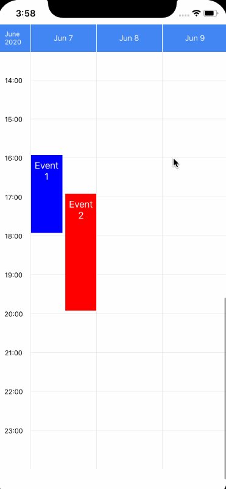

# Welcome!

The week view component for react-native. Main features:

* Supported in Android and iOS
* Many user interactions supported: [**drag and drop events**](./guides/drag-drop), [edit events](./guides/edit-event), swipe through pages, event press, grid press, etc.
* [Customizable styles](./basic-usage#customize-styles)
* [Multiple locale support](./guides/locales)
* We are actively developing! :rocket:

:::tip Note
We use [react-native-gesture-handler](https://docs.swmansion.com/react-native-gesture-handler/) and [react-native-reanimated](https://docs.swmansion.com/react-native-reanimated/) for smoother animations.
:::

:::info Note
We are still in v0.x, minor updates can include breaking changes.
See [CHANGELOG.md](https://github.com/hoangnm/react-native-week-view/blob/master/CHANGELOG.md) for details.
:::

## Links of interest

* [Installation](./installation)
* [Basic usages](./basic-usage)
* [Full API](./category/full-api)
* [Full changelog](https://github.com/hoangnm/react-native-week-view/blob/master/CHANGELOG.md)
* [Guides and examples](./category/guides)
* [Troubleshooting](./troubleshoot)

